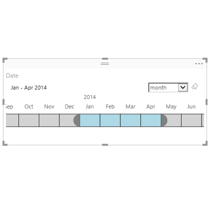

# Timeline Slicer

> Graphical date range selector to use for filtering dates

# Overview

The Timeline slicer is a graphical date range selector used as a filtering component in Power BI. This makes filtering data by date dimension easy and fun.

How often do you have to filter your data for a date range or at higher level such as month or quarter? Every single time. Right? Filtering is pain when you have to click through large numbers of date values to select the range you want. Changing the filter granularity from months, the quarters and years on the fly is super tedious. Well, it used to be super tedious.

The Timeline slicer is going to make this experience a breeze. With this simple slider control for dates, all you need to do, is just click and drag to the range that you want. You can also switch to a Year, Quarter or Month view to 
select ranges even at a higher level than dates.

You can simply click on the slicer to select a single value or click the edge and drag it to the range that you want.

You can also change the background & selection color and number of other formatting options to control the look-n-feel. SHIFT+Click also works for selecting a range.

See also [Timeline Slicer at Microsoft Office store](https://store.office.com/en-us/app.aspx?assetid=WA104380786&sourcecorrid=d6693601-bd92-40f0-90a9-a73ad6b29f1c)